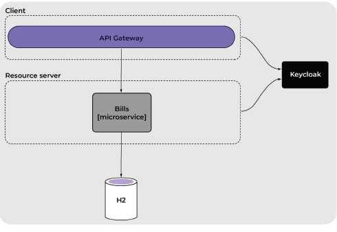
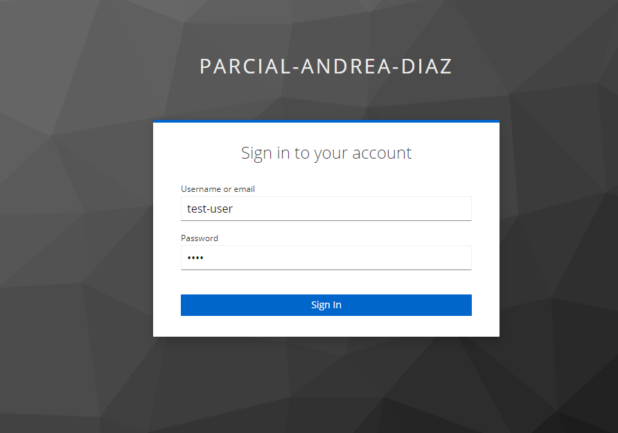
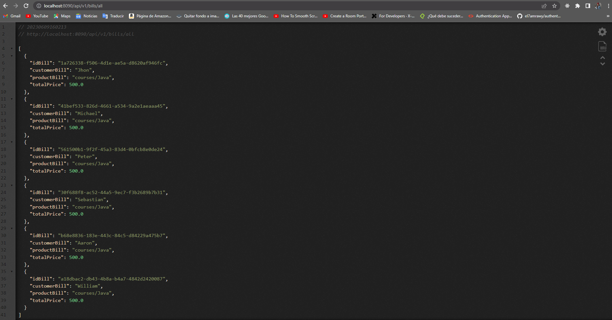

# **Trabajo Práctico - Documentación**

## **Introducción**

En este trabajo práctico, se requiere agregar módulos a un e-commerce existente. En particular, se nos pide desarrollar un microservicio llamado Bills, encargado de gestionar las facturas de los clientes y proporcionar funcionalidades como la descarga de facturas. Además, se debe implementar la seguridad en el sistema mediante el uso de KeyCloak y restricciones de acceso a las API.

## **Consigna**

La consigna consiste en desarrollar los siguientes aspectos del sistema:

1. Configuración en KeyCloak:
    - Se creó un cliente con acceso confidencial siguiendo la documentación de KeyCloak.
    - Se configuró el cliente en el API Gateway para permitir la autenticación y autorización de los usuarios.
    - Se creó el rol "USER" en KeyCloak para asignarlo a los usuarios que requieran acceso a las facturas.
2. Configuración en el API Gateway:
    - Se implementó la restricción de acceso a las APIs solo para usuarios autenticados.
    - Cuando un usuario no autenticado intenta acceder a una API protegida, se realiza una redirección al login de KeyCloak utilizando el cliente creado previamente.
    - Se agregó el filtro TokenRelay al API Gateway para enviar el token de autenticación a los microservicios.
3. Configuración en el microservicio Bills:
    - Se aplicó la restricción de acceso a las API solo para usuarios autenticados.
    - Se desarrolló un JWTConverter personalizado para obtener los roles y el scope del token JWT enviado en las solicitudes y aplicar restricciones basadas en ellos.
    - Se implementó una restricción adicional para permitir únicamente a usuarios con rol "USER" consumir el endpoint bills/all.

## **Diagrama del sistema**

Adjunto al documento se encuentra el diagrama del sistema que muestra la arquitectura propuesta, con el API Gateway y el microservicio Bills.

## **Desarrollo**

### **Configuración en KeyCloak**

1. Se creó un cliente con acceso confidencial en KeyCloak, siguiendo la documentación proporcionada.
2. El cliente fue configurado en el API Gateway para permitir la autenticación y autorización de los usuarios.
3. Se creó el rol "USER" en KeyCloak y se asignó a los usuarios que necesitarán acceder a las facturas.

### **Configuración en el API Gateway**

1. Se implementó la restricción de acceso a las APIs solo para usuarios autenticados en el API Gateway.
2. Cuando un usuario no autenticado intenta acceder a una API protegida, se redirige al login de KeyCloak utilizando el cliente configurado anteriormente.
3. Se agregó el filtro TokenRelay al API Gateway para enviar el token de autenticación a los microservicios.

### **Configuración en el microservicio Bills**

1. Se aplicó la restricción de acceso a las API solo para usuarios autenticados en el microservicio Bills.
2. Se desarrolló un JWTConverter personalizado para obtener los roles y el scope del token JWT enviado en las solicitudes y aplicar restricciones basadas en ellos.
3. Se implementó una restricción adicional en el microservicio Bills para permitir únicamente a usuarios con rol "USER" consumir el endpoint bills/all.

### **Pasos para ejecutar el proyecto**

Para ejecutar el proyecto, se deben seguir los siguientes pasos en el orden indicado:

1. Levantar Keycloak y configurar el reino.
2. Levantar el servicio ms-discovery.
3. Levantar el servicio ms-gateway.
4. Levantar el servicio ms-bills.
5. Abrir en el navegador el endpoint **[http://localhost:8090/api/v1/bills/all](http://localhost:8090/api/v1/bills/all)**.

Usuario creado: test-user

Resultado Endpoint

Nota: Algunos archivos de property fueron cambiados a yml debido a que daban errores 